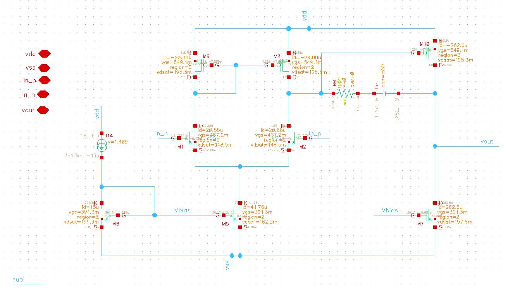
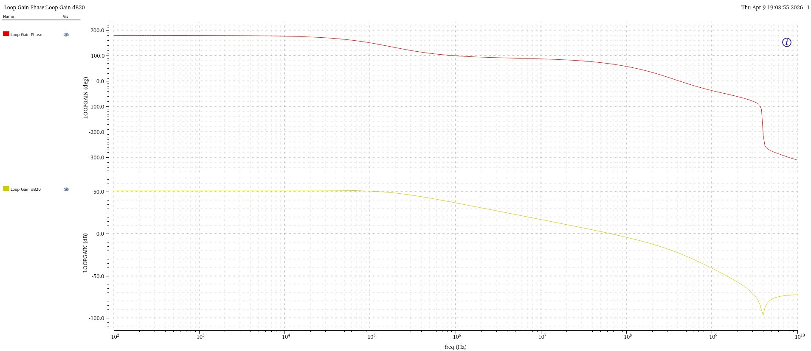
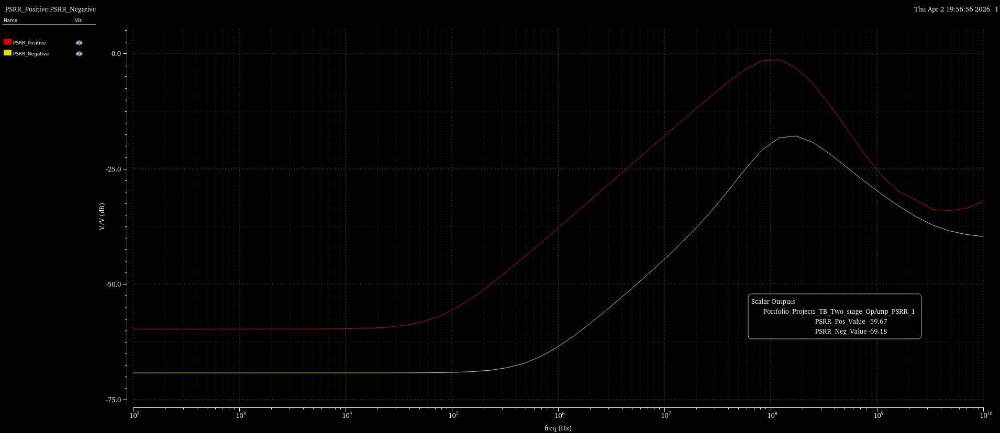
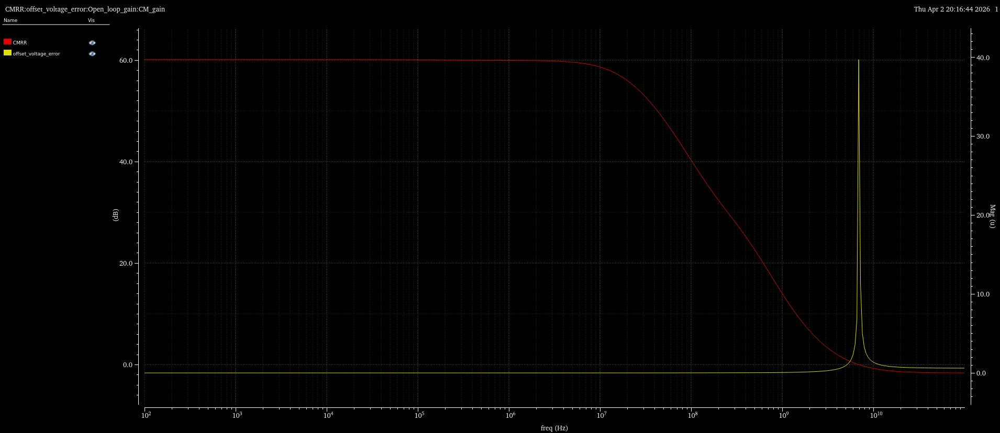

# Miller Compensated Two-Stage OpAmp Design using gm/Id Methodology in 130nm BiCMOS Technology

This project presents the design of a **Miller Compensated Two-Stage Operational Amplifier** using the **gm/Id design methodology** in **130nm BiCMOS technology**. The gm/Id approach enables systematic transistor sizing by linking key small-signal parameters to bias current density, allowing efficient exploration of the power-speed-gain design space.

The design targets analog front-end applications requiring moderate gain, wide bandwidth, and good rejection characteristics under a 1.8V supply.

---

## Achieved Specifications

| Parameter | Value |
|-----------|-------|
| DC Gain | 52 dB |
| Phase Margin | 67° |
| Unity Gain Frequency (UGF) | 60 MHz |
| PSRR+ (Positive Supply) | 60 dB |
| PSRR− (Negative Supply) | 70 dB |
| CMRR | 60 dB |
| Power Consumption | 550 μW |

---

## Circuit Schematic

The two-stage OpAmp topology consists of a **differential input stage** followed by a **common-source output stage**, with **Miller compensation** (capacitor C_c and resistor R_c in series) applied between the output of the second stage and the first stage to achieve stable frequency response.

**Design Parameters:**

| Parameter | Value |
|-----------|-------|
| Supply Voltage (VDD) | 1.8 V |
| Input Common Mode Range+ (ICMR+) | 1.6 V |
| Input Common Mode Range− (ICMR−) | 0.8 V |
| Common Mode Voltage (VCM) | 1.2 V |
| Load Capacitance (C_L) | 2 pF |
| Compensation Capacitor (C_c) | 500 fF |
| Compensation Resistor (R_c) | 2 kΩ |

> 📷 *Schematic:*
> <figure>
  
  <figcaption><b>Fig: Miller compensated two stage OpAmp</b> </figcaption>
</figure>

## Transistor Characterization

Transistors were characterized using the **gm/Id methodology**, which captures the relationship between key figures of merit across different inversion levels (weak, moderate, and strong inversion). The following lookup curves were generated from simulation:

- **Id/W vs gm/Id** — current density as a function of the transistor efficiency metric
- **gm/Id vs Vov** — efficiency versus overdrive voltage
- **gm/gds vs gm/Id** — intrinsic gain versus efficiency

### NMOS Characterization

> 📷 *NMOS characterization:*

[gm/id vs Vov](Cadence_figures/NMOS_gmid_vov.jpg)

[fT vs gm/id](Cadence_figures/NMOS_fT_gmid.jpg)

[gm/gds vs gm/id](Cadence_figures/NMOS_gmro_gmid.jpg)

[Id/W vs gm/id](Cadence_figures/NMOS_IdW_gmid.jpg)

### PMOS Characterization

> 📷 *PMOS characterization:*

[gm/id vs Vov](Cadence_figures/PMOS_gmid_vov.jpg)

[fT vs gm/id](Cadence_figures/PMOS_fT_gmid.jpg)

[gm/gds vs gm/id](Cadence_figures/PMOS_gmro_gmid.jpg)

[Id/W vs gm/id](Cadence_figures/PMOS_IdW_gmid.jpg)

## Simulation Results

### AC Response — Loop Gain & Phase

The Bode plot shows the **loop gain magnitude** and **phase response** across frequency. The design achieves:
- A flat DC gain of ~52 dB
- A well-controlled roll-off with a **Unity Gain Frequency of 60 MHz**
- A **Phase Margin of 67°**, ensuring robust closed-loop stability

> <figure>
  
  <figcaption><b>Fig: Loop Gain and Phase</b> </figcaption>
</figure>

---

### PSRR

The **Power Supply Rejection Ratio** plot shows both PSRR+ (positive rail) and PSRR− (negative rail) vs. frequency:

| Parameter | Value |
|-----------|-------|
| PSRR+ (low frequency) | ~60 dB |
| PSRR− (low frequency) | ~70 dB |

> <figure>
  
  <figcaption><b>Fig: Positive and Negative PSRR</b> </figcaption>
</figure>

### CMRR

The **Common Mode Rejection Ratio** remains flat at **~60 dB** across low and mid frequencies, with the expected roll-off at higher frequencies due to parasitic and mismatch effects.

> <figure>
  
  <figcaption><b>Fig: CMRR and Offset</b> </figcaption>
</figure>

### Corner Simulation

The design was validated across process-voltage-temperature (PVT) corners to confirm robustness:

| Parameter | TT, 27°C, 1.8V | SS, 80°C, 1.78V | FF, 0°C, 1.82V |
|-----------|:--------------:|:---------------:|:--------------:|
| DC Gain (dB) | 52.23 | 51.07 | 53.05 |
| Phase Margin (°) | 67.11 | 67.26 | 66.25 |
| UGF (MHz) | 60.5 | 56.47 | 75.7 |
| 3 dB BW (KHz) | 176.8 | 170 | 179.2 |
| CMRR (dB) | 60.1 | 58.91 | 61.05 |

-The results confirm that the design maintains **consistent performance** across all PVT corners, with phase margin staying above 66° in all cases well within the stability requirement.
